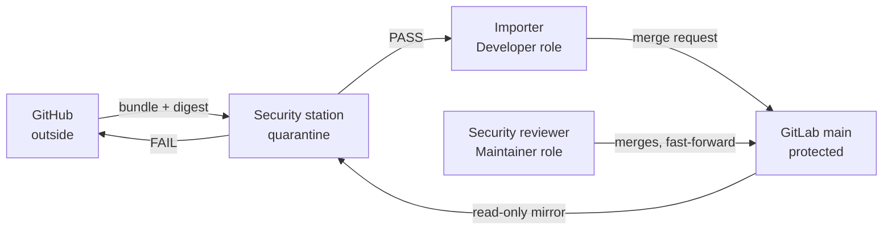

# Airlock proof run

> GitHub to internal GitLab, stage by stage, with what each step establishes.
>
> **Type:** Demonstration script
> **Last updated:** 2026-09-22

This is the narrative version, written for the people watching. The command
reference, including one-time setup and how to reset between rehearsals, is
`lab/RUNBOOK.md`.

## What the run proves

That the commit sitting on the protected branch inside GitLab is the same commit
that left GitHub, that a named person from the security team let it in, and that
nobody could have put it there any other way.

The proof rests on one property. Git names a commit by a hash of its content and
its whole ancestry, so two repositories showing the same commit hash hold
identical history, byte for byte. Nobody has to read a diff to establish that. The
run makes the two hashes visible side by side at every stage.

Five claims, each with its own stage:

1. A whole repository can cross once, as a baseline, and arrive identical.
2. An update can cross afterwards carrying only the new commits, and arrive
   identical.
3. A commit containing a secret does not cross, and the reason names the commit
   and the file.
4. The person who carries code in cannot approve it, and cannot push past the
   review.
5. Every transfer leaves evidence, and a transfer already accepted cannot be
   replayed.

What the run does not prove. The digest travelling beside a bundle shows the
bundle was not altered in transit or storage; it does not show who made it,
because anyone who can change the bundle can change the digest beside it. Signing
is the upgrade, and it is not in this lab. The scanners find what their rules
describe and no more, so a PASS is the absence of known-bad patterns, never a
statement that the code is safe. And from inside the network GitHub is
unreachable, so the comparison at the end uses the head the exporter declared in
the manifest. The run closes that gap by showing GitHub's own branch on screen
next to it, which is a human check, not an automated one.

## Before the room

One Windows PC plays three parts, and the separation between them is what the
audience is being asked to accept.

| Part | Where it runs | What it holds |
| --- | --- | --- |
| Developer zone, outside | Git Bash on the host | GitHub push rights. No GitLab credentials at all. |
| Security station, the gate | The `airlock-station` container | A read-only mirror of GitLab. No write credentials anywhere. |
| GitLab, inside | The `airlock-gitlab` container | The protected `main`, reachable on 127.0.0.1 only. |

The code moves between them like this.



The station reads GitLab and can never write to it. The importer writes to GitLab
but never to `main`. Only the reviewer merges.

Start from a lab that has never carried anything: both containers up, the GitLab
project freshly bootstrapped and empty, and GitHub sitting at the baseline commit.
`scripts/airlock-reset.sh --yes` puts it there in about a minute, and
`scripts/demo-seed.sh baseline` fills the GitHub side.

Every command below is bash, run in Git Bash. PowerShell and `cmd` cannot run any
of it. Two Git Bash windows make the demo readable, one for the developer zone and
one for the inside; `lab\airlock-shell.cmd` opens one with the credentials already
loaded, or do it by hand:

```bash
cd ~/eclipse-workspace/Hub2Lab/lab
source .secrets
source demo.env
```

Rehearse the whole thing once and record it. A live demo that fails in front of a
security department costs more than the demo was worth.

## Stage 1. The baseline crosses

The whole repository enters GitLab for the first time and arrives with the same
commit hash it had on GitHub.

```bash
scripts/airlock-export.sh --seq 1 --base none
```

Expect `15 commit(s), 178715 bytes` and a sha256. Show the three files in
`transfer/seq-0001`: the bundle, its checksum, and the manifest naming every
commit inside. A complete project history is under 200 KB, which answers the
question of what has to be carried across and on what.

```bash
docker compose exec station airlock-scan.sh 1
```

Expect `VERDICT: PASS`. Read the checks above it out loud, because their order is
the argument: the bundle's own header is checked against GitLab's current state,
the objects are unpacked with git's integrity checking on and the refs limited to
`main`, and only then do the three scanners run.

```bash
scripts/airlock-import.sh 1 --baseline
scripts/gitlab-protect.sh
scripts/airlock-confirm.sh 1
```

There is no merge request here, and saying why matters. An empty project has no
`main`, so there is nothing to open one into. Protection is applied on the next
line, on screen, which turns the gap into a visible one-time step rather than a
hole somebody spots later. Expect `main: nobody pushes, Maintainers merge,
fast-forward only, force push off`, then the two hashes side by side and
`identical SHA`.

From this point nobody can push to `main`. Not the importer, not the Maintainer,
not root.

## Stage 2. An update crosses

Two new commits appear on GitHub. The bundle carries those two and nothing else,
and the security reviewer decides whether they enter.

```bash
scripts/demo-seed.sh stage2
scripts/airlock-export.sh --seq 2 --base $(accepted)
```

Expect `2 commit(s), 1345 bytes`. This is the number that answers how updates move
week after week: 1.3 KB rather than the 178 KB of the baseline. `accepted` reads
the last commit GitLab accepted out of the receipt, so no hash is typed by hand at
any point.

```bash
docker compose exec station airlock-scan.sh 2
scripts/airlock-import.sh 2
```

Expect `pushed incoming/2 and opened a merge request into main`, then `main is
unchanged until a Maintainer merges it`. Leave that sentence on screen for a
moment. The code is now inside GitLab, on a branch, and the protected branch has
not moved.

Open the merge request in the browser signed in as `secreviewer`. Its description
carries the bundle filename, the bundle's sha256, the base it continues from, the
head it arrives at, the commit count and the verdict with the scanner versions.
The reviewer reads the diff, then merges.

Point at the merge method while merging. Fast-forward only means GitLab creates no
merge commit, so the hash cannot drift on the way in. Then:

```bash
scripts/airlock-confirm.sh 2
```

Expect the two hashes, `identical SHA`, and `recorded airlock/seq/2 in GitLab`.
That tag is the ledger entry, and stage 5 depends on it.

## Stage 3. A secret does not cross

This is the stage that earns the room. Do not cut it, and show the remediation
rather than only the block.

A developer commits the migration account's Oracle password inline in a loader
script.

```bash
scripts/demo-seed.sh stage3-secret
scripts/airlock-export.sh --seq 3 --base $(accepted)
docker compose exec station airlock-scan.sh 3
```

Expect `FAIL  gitleaks: 1 secret finding(s)` naming the commit and
`scripts/load-to-target.ps1`. The verdict names both, so the developer outside
knows what to fix without anyone forwarding code back out through a mail gateway.

Say why it is a password and not an AWS key. GitHub's own push protection matches
provider-issued credentials and refuses them at `git push`, on private
repositories too, so the airlock would never see one. It does not match this.
Neither does trivy nor opengrep, because at the head of the branch there is
nothing unusual to see. The only thing standing between that password and the
internal GitLab is the history-scoped pass at the gate.

Then the fix a developer reaches for first.

```bash
scripts/demo-seed.sh stage3-removal
scripts/airlock-export.sh --seq 3 --base $(accepted)
docker compose exec station airlock-scan.sh 3
```

Still `FAIL`, and still naming the earlier commit. The files at the head are clean
now. The password is in the history, and history is what crosses. This is usually
the moment the security audience stops taking notes and starts asking questions.

And the fix that works. Only commits the security team has never accepted are
rewritten, so the last accepted commit stays an ancestor and the fast-forward
inside GitLab is still possible.

```bash
AIRLOCK_LAST_ACCEPTED=$(accepted) scripts/demo-seed.sh stage3-rewrite
scripts/airlock-export.sh --seq 3 --base $(accepted)
docker compose exec station airlock-scan.sh 3
scripts/airlock-import.sh 3
```

Expect `VERDICT: PASS`. The reviewer merges as in stage 2,
`scripts/airlock-confirm.sh 3` shows the hashes matching, and the ledger records
`airlock/seq/3`.

## Stage 4. Nobody bypasses the reviewer

Run this while a merge request is open, so both refusals land against a live
request rather than a hypothetical one.

The importer holds the Developer role. First they try to push straight to the
protected branch:

```bash
scripts/airlock-import.sh 3 --direct-to-main
```

Expect `remote: GitLab: You are not allowed to push code to protected branches on
this project.` followed by `pre-receive hook declined`. The refusal comes from
GitLab's server-side hook, not from the script, which matters: the script could be
edited by whoever runs it, and the hook could not.

Then they try to approve their own work:

```bash
curl -sS -X PUT -H "PRIVATE-TOKEN: $IMPORTER_TOKEN" \
  "$GITLAB_URL/api/v4/projects/$GITLAB_PROJECT_ID/merge_requests/<iid>/merge"
```

Expect `{"message":"401 Unauthorized"}`. Only a Maintainer merges, and the
security team holds the only Maintainer account.

Worth naming honestly: in Community Edition this role split is the substitute for
the approval rules that come with the paid tiers. The security team has to accept
that substitution knowingly.

## Stage 5. The receipt closes the loop

Present a bundle that has already been accepted:

```bash
docker compose exec station airlock-scan.sh 3
```

Expect `FAIL  seq 3 was already accepted (tag airlock/seq/3 exists in GitLab) -
replay refused`.

The ledger lives in GitLab as the `airlock/seq/<n>` tags, not in a file on the
station. That is deliberate. The station's mirror can be deleted and rebuilt from
scratch at any time, and the gate still refuses a replay, because the memory it
consults belongs to the system being protected.

One practical note: this rescan overwrites `transfer/seq-0003/verdict.json` with
the FAIL. That is correct, but it means the seq-3 evidence no longer shows the
PASS. Run this beat last, or copy the directory first.

## What every transfer leaves behind

Three JSON files per transfer and one tag in GitLab. No database, no service to
keep running, readable in five years with nothing but a text editor.

| File | Written by | What it records |
| --- | --- | --- |
| `manifest.json` | The exporter, outside | What was sent: every commit hash, the base, the head, the bundle's sha256 and size |
| `verdict.json` | The gate | PASS or FAIL, the counts per scanner, the exact scanner versions, the rules digest, and the script version |
| `receipt.json` | The reviewer, inside | What was accepted: the hash on `main`, the ledger tag, and the base for the next export |
| `airlock/seq/<n>` | The reviewer, inside | The durable ledger entry, held in GitLab itself |

Show one of them on screen:

```bash
ls transfer/seq-0002
cat transfer/seq-0002/receipt.json
```

Two details worth pointing at. The verdict names the scanner versions and a digest
of the rules directory, so a decision can always be tied to the code and the rules
that produced it, months later. And the receipt's `next_export_base` is what the
following export continues from, which is how the chain stays unbroken without
anybody tracking hashes by hand.

The `exporter` and `confirmed_by` fields are labelled in the files themselves as
provenance labels rather than attestations. They say who ran the step; they do not
prove it. That is the same gap signing would close.

## What can go wrong on the day

Each of these has actually happened during rehearsal.

| Symptom | What it is | What to do |
| --- | --- | --- |
| GitLab serves 502 for a long time | First boot takes 5 to 10 minutes, a restart 2 to 3 | Wait. If it never resolves, raise the WSL2 memory ceiling in `%UserProfile%\.wslconfig` to at least 8 GB and restart Docker Desktop |
| The bootstrap says there is no root account | GitLab's first-boot seed refuses passwords it reads as word combinations, and fails quietly | Put a generated password in `lab/.env` and re-run the bootstrap, which re-seeds by itself |
| The bootstrap cannot create the project, "path has already been taken" | A deleted GitLab project keeps its path reserved and answers lookups through a redirect | `scripts/airlock-reset.sh --yes`, which removes those permanently and waits for the path |
| The station cannot reach GitLab | It holds the old read-only deploy token from before a re-bootstrap | `docker compose up -d --force-recreate station` |
| A `demo-seed.sh` push is refused for rule violations | GitHub push protection recognised a real credential shape | Not a bug to work around. Stage 3 plants a password precisely because GitHub does not match it |
| The export refuses with "base is NOT an ancestor" | Someone rewrote history the security team already accepted | Stop. Do not export. The re-baseline procedure in the design document applies |

The last row is the only one that is a policy event rather than a lab problem, and
it is worth mentioning to the audience if it comes up. The export refuses to
produce a bundle at all, because the fast-forward inside GitLab has become
impossible and quietly forcing it through would break the property the whole thing
rests on.

One thing that does not update on its own. The static analysis rules are pinned to
an archived repository, which is the last version of that rule set that may be
redistributed. Gitleaks and trivy keep their own updatable data; the static
analysis layer does not improve over time without someone curating rules. It
belongs on the follow-up list, not hidden in a footnote.
